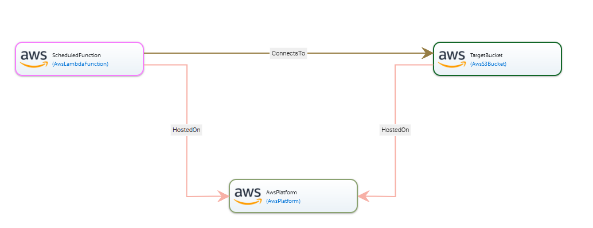

## ScheduledLambdaInvocation Blueprint

This blueprint represents a schedule-based invocation of AWS Lambda function.
In this example, a function is triggered based on a user-provided schedule expression (cron or rate expression) to query the list of the global air quality data from the previous day and store it in the AWS S3 bucket in .json format.
The air quality data is queried from the [OpenAQ](https://registry.opendata.aws/openaq/) dataset available in the AWS registry for open data.
To simplify checking the results, in this particular example, the specified schedule is "invoke every minute", which is not acutally required and can be changed to once per day invocation.

Note, that to run this example it is required to assign the permissions for Amazon EventBridge in the AWS credentials.

## Application Topology

